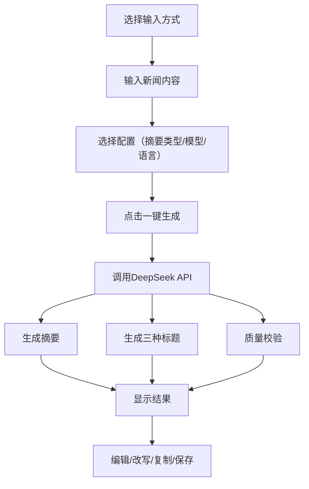

## 1. Product Overview
AI新闻助手是一个基于DeepSeek API的新闻摘要与标题生成工具，帮助用户快速将新闻内容转化为精炼摘要和多种风格标题。目标用户为新闻编辑、内容创作者和自媒体从业者，提供高效的内容处理能力。

## 2. Core Features

### 2.1 User Roles
| Role | Registration Method | Core Permissions |
|------|---------------------|------------------|
| Normal User | System authentication | 使用全部功能 |

### 2.2 Feature Module
1. **新闻摘要与标题生成页**: 核心功能页面，包含内容输入、摘要生成、标题生成、质量校验
2. **首页**: 系统主页入口
3. **今日新闻速览**: 新闻预览功能
4. **个人历史**: 用户操作历史记录
5. **数据分析**: 数据统计与分析
6. **设置中心**: 系统配置
7. **退出登录**: 安全退出

### 2.3 Page Details
| Page Name | Module Name | Feature description |
|-----------|-------------|---------------------|
| 新闻摘要与标题生成页 | 内容输入区 | 支持文本输入、文件批量上传、语音上传、视频上传四种方式 |
| 新闻摘要与标题生成页 | 摘要类型选择 | 下拉框选择：标准摘要、简短摘要、详细摘要 |
| 新闻摘要与标题生成页 | 模型选择 | 下拉框选择：DeepSeek、豆包、文心一言、Kimi、千问 |
| 新闻摘要与标题生成页 | 语言选择 | 下拉框选择：中文、English |
| 新闻摘要与标题生成页 | 一键生成 | 触发AI生成摘要和标题 |
| 新闻摘要与标题生成页 | 摘要生成区 | 显示生成的摘要内容，支持编辑、保存、一键复制 |
| 新闻摘要与标题生成页 | 标题生成区 | 生成三种类型标题：客观纪实型、数据亮点型、轻量化标题，每种支持改写和复制 |
| 新闻摘要与标题生成页 | 质量校验区 | 显示覆盖率检测、标题偏离度、幻觉检测指标 |
| 新闻摘要与标题生成页 | 流程进度条 | 5步进度指示：内容上传→摘要生成→标题生成→质量校验→数据可视化 |

## 3. Core Process

用户流程：选择输入方式 → 输入新闻内容 → 选择摘要类型、模型、语言 → 点击一键生成 → 查看摘要和标题 → 编辑/改写/复制/保存

## 4. User Interface Design

### 4.1 Design Style
- **主色调**: 蓝色系（#1971c2、#a5d8ff）作为主色调，白色背景，深灰色文字
- **按钮风格**: 圆角矩形，蓝色高亮选中状态
- **字体**: 现代无衬线字体，标题使用28px，正文使用16-20px
- **布局**: 左侧导航栏 + 右侧主内容区，卡片式布局
- **图标**: 使用简洁现代的图标风格

### 4.2 Page Design Overview
| Page Name | Module Name | UI Elements |
|-----------|-------------|-------------|
| 新闻摘要与标题生成页 | 左侧导航栏 | 系统标题、导航菜单、设置中心、退出登录 |
| 新闻摘要与标题生成页 | 流程进度条 | 5步圆形指示器，连接线，步骤文字说明 |
| 新闻摘要与标题生成页 | 内容输入区 | 输入方式切换按钮、输入框/上传区域、配置下拉框、一键生成按钮 |
| 新闻摘要与标题生成页 | 摘要生成区 | 标签显示、摘要内容显示框、编辑/保存/复制按钮 |
| 新闻摘要与标题生成页 | 标题生成区 | 三个标题类型输入框、改写/复制按钮 |
| 新闻摘要与标题生成页 | 质量校验区 | 三个指标圆形展示、百分比/分数/数量显示 |

### 4.3 Responsiveness
- 桌面优先设计
- 支持响应式布局，移动端自适应

### 4.4 3D Scene Guidance
- 不涉及3D场景