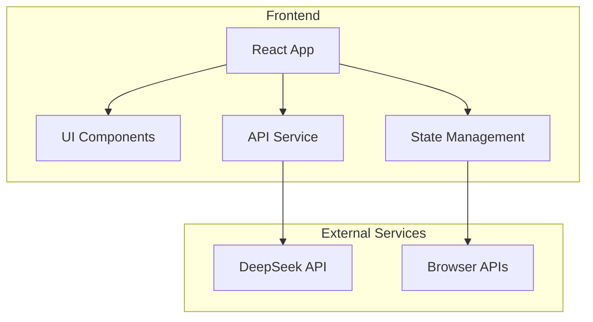
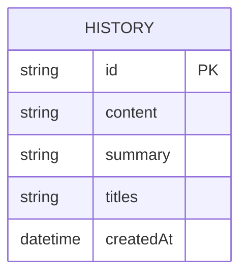

## 1. Architecture Design



## 2. Technology Description
- **Frontend**: React@18 + tailwindcss@3 + vite
- **Initialization Tool**: vite-init
- **Backend**: None (API calls made directly from frontend)
- **External API**: DeepSeek API (https://api.deepseek.com/chat/completions)

## 3. Route Definitions
| Route | Purpose |
|-------|---------|
| / | 首页/新闻摘要与标题生成页 |

## 4. API Definitions

### DeepSeek API Integration
**Endpoint**: `POST https://api.deepseek.com/chat/completions`

**Request Body**:
```typescript
interface DeepSeekRequest {
  model: string;
  messages: {
    role: 'system' | 'user';
    content: string;
  }[];
  temperature?: number;
  max_tokens?: number;
}
```

**Response**:
```typescript
interface DeepSeekResponse {
  choices: {
    message: {
      content: string;
    };
  }[];
  usage: {
    prompt_tokens: number;
    completion_tokens: number;
    total_tokens: number;
  };
}
```

### Model Selection
| Model Name | Model ID |
|------------|----------|
| DeepSeek | deepseek-v4-flash |
| 豆包 | doubao |
| 文心一言 | wenxin |
| Kimi | kimi |
| 千问 | qianwen |

## 5. Server Architecture Diagram
- 无后端服务，前端直接调用DeepSeek API

## 6. Data Model
- 本地状态管理，无需数据库
- 使用localStorage存储用户操作历史

### 6.1 Data Model Definition


### 6.2 Data Definition Language
- 使用localStorage存储，无需DDL